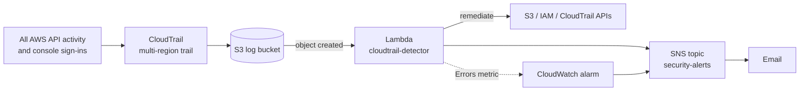

# AWS CloudTrail Detection & Auto-Remediation Lab

A log-based detection pipeline for a single AWS account. Every CloudTrail
log file that lands in S3 triggers a Lambda function that parses the raw
events, matches them against detection rules mapped to MITRE ATT&CK, sends
alerts, and automatically remediates three high-risk changes. A CloudWatch
alarm watches the detector itself, so a broken deployment can't leave the
account silently unmonitored.

## Architecture



Stack: CloudTrail, S3, Lambda (Python 3.14), IAM, SNS, CloudWatch. Region: us-east-2.

## Detections and test results

| Detection | Severity | Response | MITRE ATT&CK | Live test |
|---|---|---|---|---|
| S3 public access weakened | High | **Auto-remediate:** re-enable Block Public Access | T1530 Data from Cloud Storage | ✅ Fixed, alert in ~1 min |
| New IAM access key created | Medium | **Auto-remediate:** deactivate key (allowlist supported) | T1098.001 Additional Cloud Credentials | ✅ Deactivated, alert in ~2–4 min |
| CloudTrail logging stopped/modified | Critical | **Auto-remediate:** restart logging | T1562.008 Disable or Modify Cloud Logs | ✅ Logging restarted, alert in ~2 min |
| IAM user console login without MFA | Medium | Alert | T1078.004 Valid Accounts: Cloud Accounts | ⚠️ Unit-tested only: org SCP denies `iam:CreateLoginProfile` |
| Root console login | High | Alert | T1078.004 | ⚠️ Unit-tested only: account access is role-based |
| Detector failing (CloudWatch alarm) | — | Alert | — | ✅ Fired after injected malformed event |

Timings are from single test runs; CloudTrail log delivery typically takes up to several minutes.

## Why log-based detection instead of EventBridge

The original design used EventBridge rules in us-east-1. The account runs in
AWS's simplified project setup, where an organization service control
policy denies regional actions outside us-east-2 (diagnosed from an
`AccessDenied ... explicit deny in a service control policy` error).
Unlocking other regions required leaving the Free plan. Because IAM and
console sign-in events are only delivered to EventBridge in us-east-1, the
design moved to reading CloudTrail's log files from S3 instead: a
multi-region trail writes those events there regardless of region.
Trade-off: alert latency depends on log-file delivery rather than being
near real time.

## Design decisions

- **Detection-as-code:** rules live in one Python list (`RULES`), each with
  a severity, MITRE technique, match function, and optional fix.
- **Least privilege:** the function's role allows six narrowly scoped
  actions (`iam/cloudtrail-detector-policy.json`). Verified in testing: IAM
  remediation failed under a broad role that excluded IAM, then succeeded
  under the scoped role.
- **No alert loops:** events made by the function's own role session are ignored.
- **Failed calls ignored:** events with an `errorCode` changed nothing.
- **Actionable failures:** failed remediations report AWS's full error
  message in the alert, not just the error code.
- **Log integrity:** CloudTrail log file validation enabled; digest files
  are skipped by the detector.
- **Monitoring the monitor:** CloudWatch alarm on the function's `Errors`
  metric (Sum ≥ 1 over 5 minutes, missing data = not breaching) alerts
  through the same SNS topic.
- **Unit tested:** `tests/` covers each rule, the allowlist, loop
  prevention, failed-call handling, and gzip parsing with mocked AWS clients.

## Issues found during testing

| Symptom | Root cause | Fix |
|---|---|---|
| `AccessDenied` listing trails in us-east-1 | Org SCP restricts regions to us-east-2 | Redesigned to log-based detection in one region |
| Key remediation failed with only `AccessDenied` | Alert included error code only | Added AWS's full error message to alerts |
| No alerts after a code edit; `Runtime.UserCodeSyntaxError` in logs | Indentation error from manual edit left detection down ~35 min | Redeployed full file; added CloudWatch error alarm |
| Key remediation denied: "no identity-based policy allows iam:UpdateAccessKey" | Function was running as a broad `PowerUserRole`, not the scoped role | Switched execution role; re-ran all remediation tests |
| Could not create console password for test user | Org SCP explicit deny on `iam:CreateLoginProfile` | Documented as preventive control; rule kept as unit-tested |

## Repo layout

```
lambda/lambda_function.py            detection engine and remediations
iam/cloudtrail-detector-policy.json  least-privilege role policy
tests/                               offline unit tests
docs/SETUP.md                        build, test and teardown guide
```

Run tests: `pip install boto3 && python -m unittest discover tests`

## Evidence

<!-- Add screenshots (blur account ID, IPs, email) -->

## What I learned

<!-- Write this yourself. -->

## Next steps

- Alert on `UpdateAccessKey` setting a key back to Active (a reactivated
  old key currently isn't detected)
- Deploy with Terraform
- Forward the same logs to Splunk and port the rules to SPL
- State tracking (DynamoDB) to detect bursts, e.g. repeated failed logins
